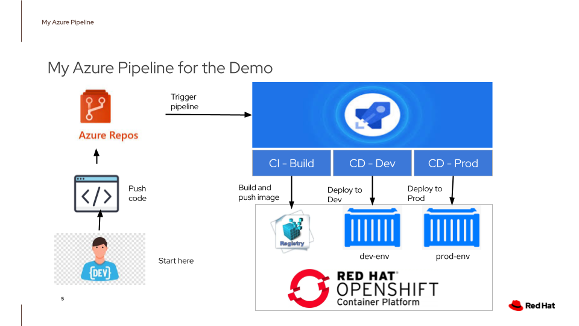
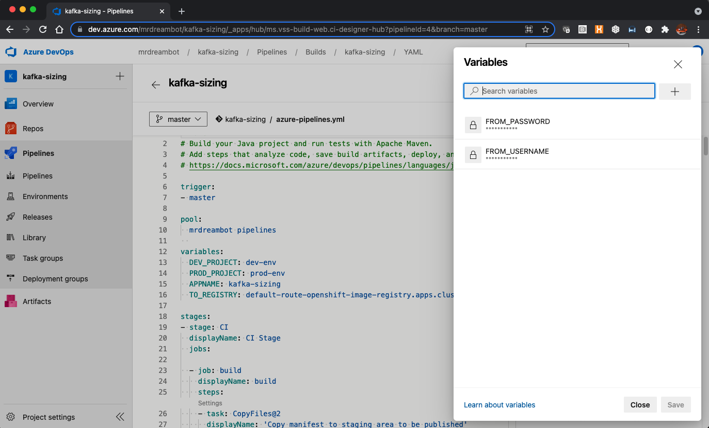
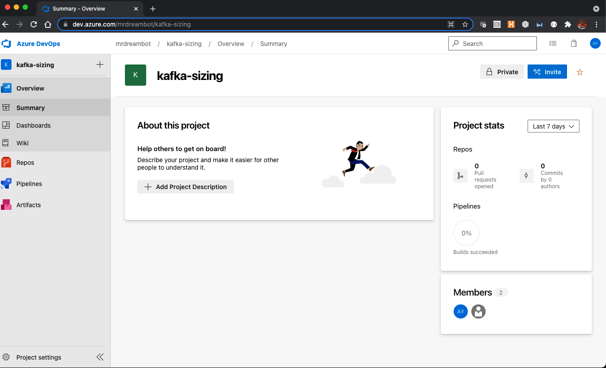
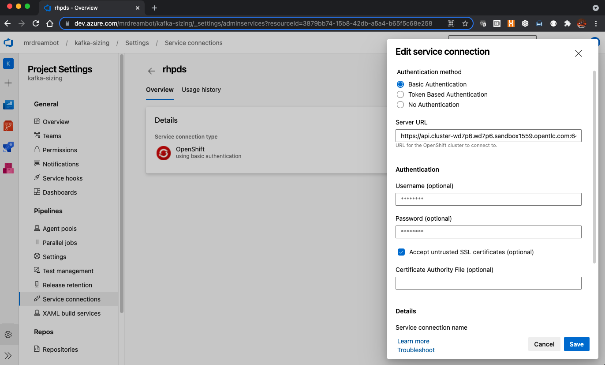

# Using Azure DevOps with Openshift

I am assuming that you already know what Azure DevOps and Openshift are. Let me tell you about my Azure pipeline.
   
You can watch my Youtube demo here:

  
## 1 Youtube Videos On the Topic
Before creating this pipeline, I watched a number of Youtube videos on the subject to ensure that I am not repeating something that has been done time and time again. These videos have 3 things in common, they:

* Deploy a simple application resulting in a single container
* Use Openshift Source-to-image toolkit to build container images on Openshift
* Need to execute many commands on Openshift before the pipeline will work eg, creating new projects and manifests which define the resources required by the application, etc.

  
## 2 Doing Things Differently
The 3 common things identified in the previous section are not necessarily bad things. I just want to do things differently. Hence I:

* Build and deploy a more realistic application consisting of a Java microservice and a MySQL database
* Build the container image in the pipeline and push it directly to the Openshift image registry. This is achieved by using the Maven Google jib plugin.
* My pipeline takes cares of tasks needed on Openshift for the deployment of my microservice and MySQL database.

  
Here is a pictorial representation of my Azure DevOps YAML pipeline:

  
Starting from the botton left corner, a developer creates/changes code and pushes the code to the Azure Repository. Changes in the repo trigger the pipeline. The pipeline consists of 3 stages:

* CI build - builds an image, performs some tests and pushes the image directly to the Openshift Image Registry
* CD Dev -  creates a project to simulate a Dev environment, processes manifests to create a MySQL database and initialises it with database tables required by the microservice. It then deploys the MySQL database and the microservice on Openshift
* CD Prod - similar to CD Dev but it requires my approval to start this stage of the pipeline to deploy to the Prod environment.

  
## 3 Adapting My Azure Pipline to Run in Your Environment

### 3.1 On Openshift:
Since I am pushing the image built in the CI-Build pipeline stage directly to the Openshift image registry, I have to make sure that there is a route to access the registry from outside of Openshift. Login as a cluster admin and issue the command:
<pre>
oc get route default-route -n openshift-image-registry --template='{{ .spec.host }}';echo
default-route-openshift-image-registry.apps-crc.testing
</pre>
If it displays a route to the image registry, that means you are good to go and you can skip the following commands:
<pre>
oc patch configs.imageregistry.operator.openshift.io/cluster --patch '{"spec":{"defaultRoute":true}}' --type=merge

oc get route default-route -n openshift-image-registry --template='{{ .spec.host }}';echo
default-route-openshift-image-registry.apps-crc.testing
</pre>
The second command displays the route to access Openshift's image registry. This confirms that a route has been created to access the image registry from outside of Openshift.

### 3.2 On Azure DevOps:
Do the following:
* Replace the secret variables: "FROM_USERNAME" and "FROM_PASSWORD" with your login to access registry.access.redhat.com to get the base image for the microservice.

  
* I am using my self-hosted agent in the "mrdreambot pipelines" pool to execute the pipeline. You may either change it to use your own self-hosted agent or a microsoft hosted agent. For the former, please note that you must have Java JDK, maven, and oc installed on my self-hosted agent.
<pre>
	pool:
	  mrdreambot pipelines
</pre>
  
* From your Azure project, click on "Project Settings" at the bottom left corner of the page and then select "Service Connections" on the left-hand pane and change the "Service URL", "Username" and "Password" to login in to a normal Openshift user account ie, no special priveleges are required. See screenshots below:

  

* Change the "TO_REGISTRY" variable  in the "variables" section near the top of the YAML pipeline to point to the route to access your Openshift image registry.
  

